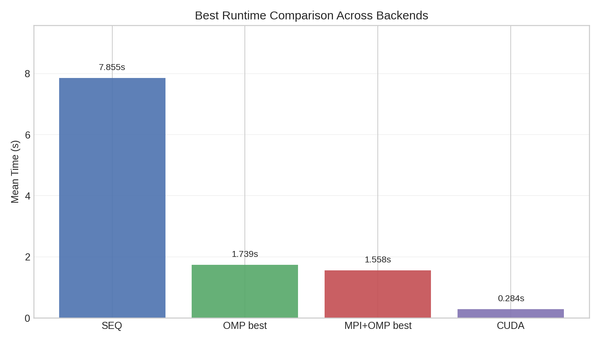
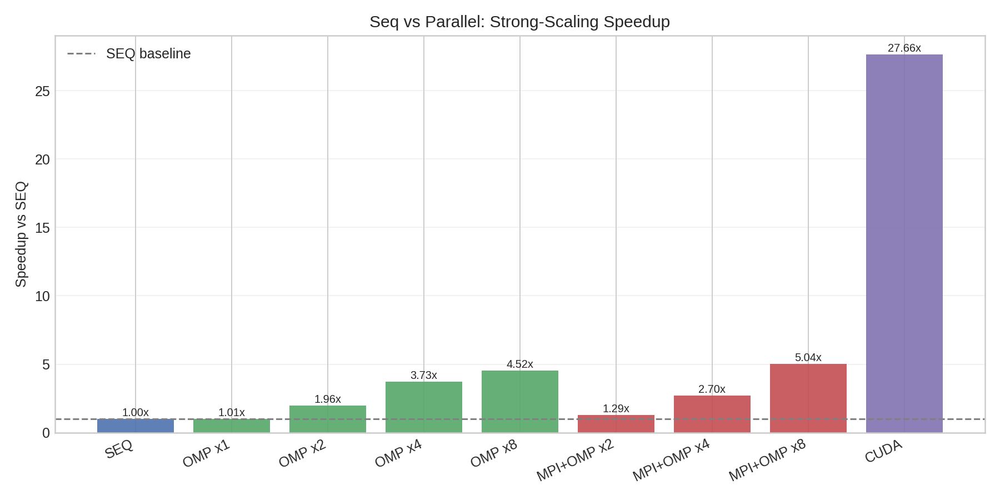
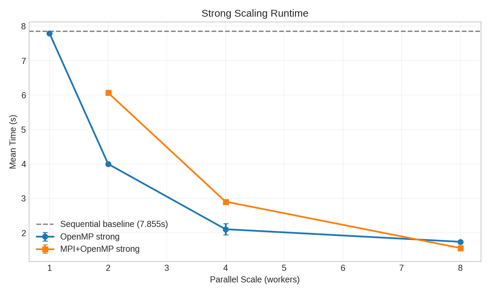
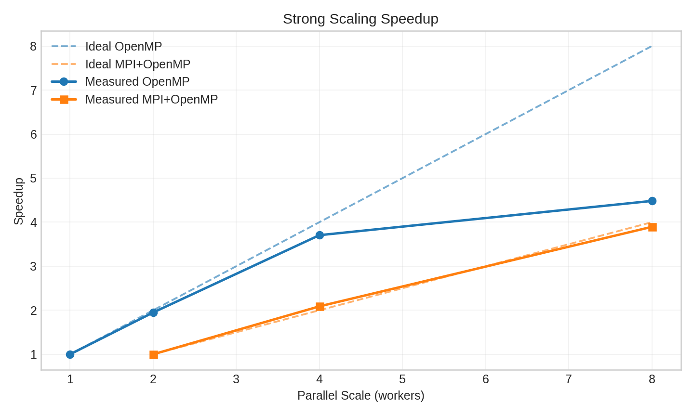
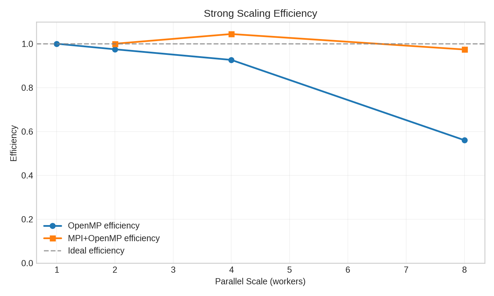
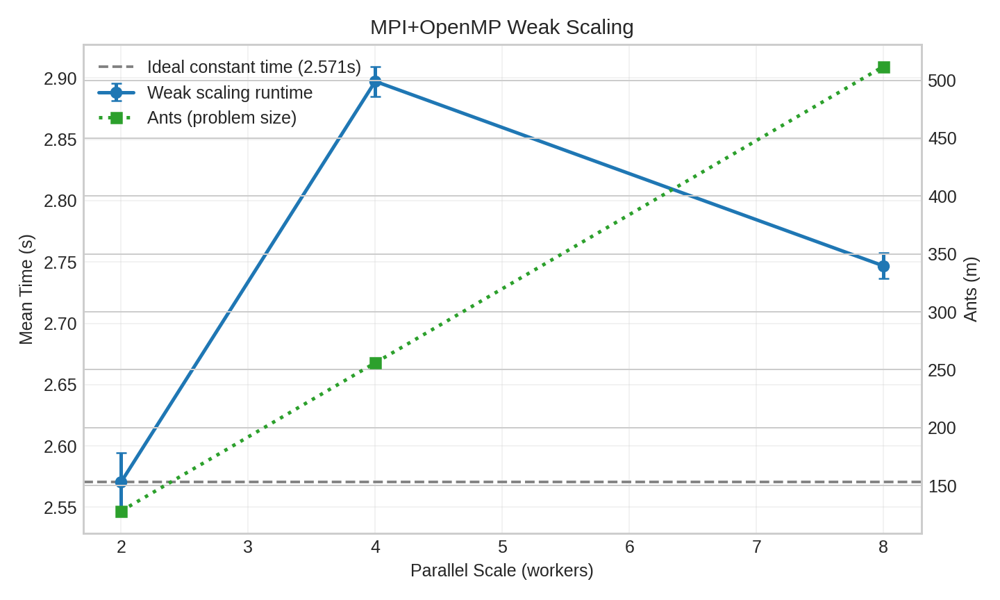
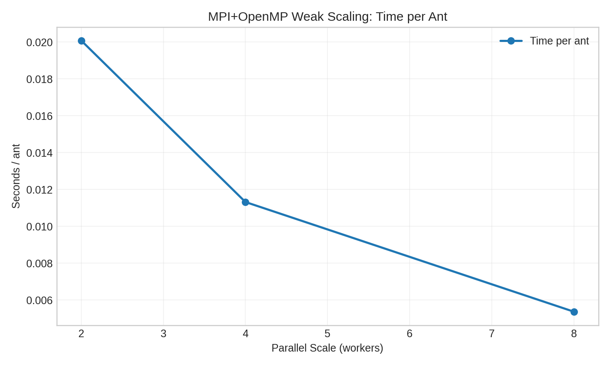

# Vehicle Routing Problem with Ant Colony Optimization (C / OpenMP / MPI / CUDA)

This repository implements a **Vehicle Routing Problem (VRP)** solver based on **Ant Colony Optimization (ACO)**, starting from a sequential baseline and adding parallel backends required by the project:

- `seq`: sequential baseline
- `omp`: shared-memory parallelization with OpenMP
- `mpi+omp`: distributed-memory + multithreading hybrid parallelization
- `cuda`: GPU acceleration of ant construction and pheromone evaporation

The codebase is intentionally written in **C and CUDA C only** (no C++ interfaces or runtime dependencies).

## 1. Problem and Algorithm

Given a complete graph with depot `0` and customers `1..n`, the solver builds `K` routes that:

- start and end at depot `0`
- visit each customer exactly once overall
- minimize total travel cost

### ACO core flow (all backends)

1. Initialize heuristic matrix `eta[i][j] = 1 / (c[i][j] + eps)` and pheromone matrix `tau[i][j] = tau0`.
2. For each iteration:
   - each ant constructs a feasible VRP solution stochastically
   - choose iteration-best ant (deterministic tie-break on ant id)
   - update global best if improved
   - evaporate pheromones
   - deposit pheromones on iteration-best route edges

### Construction rule

For each vehicle, the ant selects customers with roulette-wheel sampling using:

`score(i,j) = tau[i][j]^alpha * eta[i][j]^beta`

A feasibility guard keeps enough unvisited customers for remaining vehicles.
Leftover customers are appended to the last route.

## 2. Repository Structure

```text
include/
  aco.h                 # public API for seq/omp/mpi/cuda solvers
  matrix.h              # contiguous matrix allocation helpers
  solution.h            # Route/Solution data structures and validation

src/
  common/
    aco_common.c/.h     # backend-independent ACO routines
    matrix.c            # contiguous (n+1)x(n+1) matrix allocator
    solution.c          # solution lifecycle, cost, validation

  seq/
    aco_seq.c           # sequential ACO implementation
    main_seq.c          # CLI + timing for sequential run

  omp_mpi/
    aco_openmp.c        # OpenMP implementation
    aco_mpi.c           # MPI + OpenMP hybrid implementation
    aco_mpi_utils.c/.h  # flatten/unflatten helpers for MPI broadcasts
    main_omp.c          # CLI + timing for OpenMP run
    main_mpi.c          # MPI entrypoint, argument validation, timing

  cuda/
    aco_cuda.cu                 # host orchestration for CUDA backend
    aco_cuda_kernels.cu/.h      # CUDA kernels (init, ants, evaporation)
    aco_cuda_host_utils.cu/.h   # pinned/device buffers and copy helpers
    main_cuda.c                 # CLI + timing for CUDA run

tests/
  test_aco.c            # unit tests for core correctness and invariants

scripts/
  benchmark_pipeline.py # Single entrypoint: benchmark + plot generation
  benchmark_scaling.py  # Core benchmark runner (used by pipeline)
  plot_scaling_results.py # Plot generator (used by pipeline)
```

## 3. Parallelization Design

### 3.1 OpenMP backend (`src/omp_mpi/aco_openmp.c`)

- Parallel region over ants (`#pragma omp for schedule(static)`).
- Uses `default(none)` to force explicit `shared/private` declarations.
- Thread-local ant buffers (`Solution` + `visited`) avoid races.
- Thread-best solutions are merged inside a small `critical` region.
- A reduction flag (`worker_failed`) propagates allocation failures safely.

### 3.2 MPI + OpenMP backend (`src/omp_mpi/aco_mpi.c`)

- Ant population is partitioned across ranks with balanced block distribution.
- Each rank evaluates its local ants with OpenMP.
- Local best candidates are reduced with `MPI_Allreduce(..., MPI_MINLOC)`.
- Owner rank broadcasts the iteration-best solution to all ranks.
- Pheromone matrices are synchronized every `sync_every` iterations via `MPI_Allreduce` + averaging.
- All collectives are executed in consistent order to avoid deadlocks.

### 3.3 CUDA backend (`src/cuda/*`)

- `aco_cuda_construct_ants_kernel`: one GPU thread per ant.
- `aco_cuda_evaporate_tau_kernel`: matrix-wide evaporation on device.
- Host-side best-ant selection and pheromone deposit (clear control logic and easier route handling).
- Pinned host memory + non-blocking streams + events are used to overlap:
  - kernel execution
  - D2H/H2D transfers

## 4. Build

Requirements:

- `gcc`, `make`
- OpenMP support in compiler
- MPI toolchain (`mpicc`, `mpirun`) for hybrid backend
- optional CUDA toolkit (`nvcc`, `cuda runtime`) for GPU backend

Build targets:

```bash
make seq
make omp
make mpi
make mpi-cuda
make cuda
make test
make benchmark
```

CUDA build notes:

- Default build targets `sm_75` (`CUDA_ARCH=75`), suitable for GTX 1650.
- To target another GPU architecture:

```bash
make cuda CUDA_ARCH=86
```

- If you see `unsupported toolchain` or PTX JIT errors, either:
  - compile with the correct `CUDA_ARCH` for your GPU, or
  - align driver/toolkit versions (driver must support the installed CUDA toolkit).

## 5. Run

### Sequential

```bash
./aco_vrp_seq [n K m T]
```

### OpenMP

```bash
./aco_vrp_omp [threads] [n K m T]
# examples:
./aco_vrp_omp 8
./aco_vrp_omp 8 100 8 256 120
```

### MPI + OpenMP

```bash
mpirun -np <ranks> ./aco_vrp_mpi [threads_per_rank sync_every] [n K m T]
# example:
mpirun -np 4 ./aco_vrp_mpi 2 1 100 8 256 120
```

### CUDA

```bash
./aco_vrp_cuda [n K m T]
```

### MPI + CUDA (multi-GPU)

```bash
mpirun -np <ranks> ./aco_vrp_mpi_cuda [n K m T]
```

All binaries print at least:

- backend mode
- problem size
- best cost
- elapsed wall time (`elapsed: ... s`)

## 6. Testing and Validation

Run unit tests:

```bash
make test
```

The test suite covers:

- basic route correctness
- solution validation constraints
- exact optimal comparison on small instances
- OpenMP consistency versus sequential baseline

## 7. Scaling Benchmark Workflow (Python)

The script `scripts/benchmark_pipeline.py` is the single entrypoint and automates:

- build (via `make` targets; include `cuda` with `--include-cuda`)
- repeated runs with warmups
- strong scaling for OpenMP and MPI+OpenMP
- weak scaling for MPI+OpenMP
- CSV generation + plot generation

### Default run

```bash
python3 scripts/benchmark_pipeline.py
```

### Example custom run

```bash
python3 scripts/benchmark_pipeline.py \
  --repeats 4 \
  --warmups 1 \
  --n 120 --k 8 --m 320 --t 150 \
  --omp-threads 1,2,4,8 \
  --mpi-ranks 1,2,4 \
  --mpi-threads-per-rank 2
```

### Generated outputs

- `reports/scaling_results_raw.csv`: every run (including warmups and failures)
- `reports/scaling_summary.csv`: aggregated mean/std/speedup/efficiency
- `reports/plots/*.png`: benchmark plots

## 8. Reporting (in README)

The benchmark report is kept in this README, while raw/summary CSV data stays in `reports/`.

Generated plot files:

- `reports/plots/backend_comparison.png`
- `reports/plots/seq_vs_parallel_speedup.png`
- `reports/plots/strong_runtime.png`
- `reports/plots/strong_speedup.png`
- `reports/plots/strong_efficiency.png`
- `reports/plots/weak_runtime.png`
- `reports/plots/weak_time_per_ant.png`

### Plots









## 9. Code Quality Notes

Key practices applied in this codebase:

- explicit error handling for allocations and MPI/CUDA calls
- deterministic seed generation for reproducibility
- explicit OpenMP sharing model (`default(none)`)
- synchronization minimized to critical merge points
- safe MPI collective ordering and input validation
- pinned memory and stream/event synchronization in CUDA path
- comments added around non-trivial concurrency and memory logic

## 10. Known Limitations

- CUDA still copies back best route metadata each iteration to keep `best_solution` on host synchronized.
- CUDA execution requires a compatible driver/runtime environment.
- TSPLIB parser currently supports EUC_2D coordinates (minimal subset), not full CVRP constraints handling.

## 11. Suggested Next Extensions

- extend TSPLIB parser support (demands/capacity/edge-weight variants)
- add cooperative pheromone exchange across ranks in MPI+CUDA mode
- add automated plot generation (speedup/efficiency charts) from CSV results
